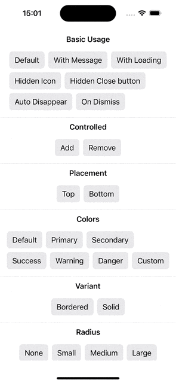

#  Toast Demo in SwiftUI

A demo of using the [SwiftUI Toaster package](https://github.com/0Itsuki0/Toaster-SwiftUI) for showing toasts.

Please check out the package [README](https://github.com/0Itsuki0/Toaster-SwiftUI) more examples.
